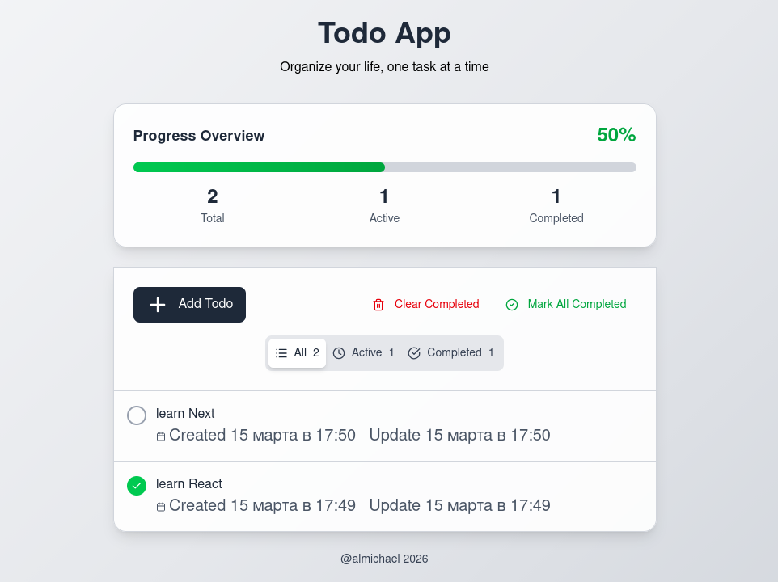

# Todo React App

A modern Todo application built with **React, TypeScript and Redux Toolkit**.  
The app allows users to create, edit, complete and filter tasks with persistent storage.

---

## 🔗 Live Demo
[](https://todo-react-redux-tailwind.vercel.app/)

## Features

- ➕ Add new todos
- ✏️ Edit existing todos
- ✅ Mark todos as completed
- 🗑 Delete todos
- 🔎 Filter tasks (All / Active / Completed)
- 📊 Task statistics
- 💾 LocalStorage persistence
- ⚡ Fast state management with Redux Toolkit
- 🎨 Responsive UI

---

## Tech Stack

- React
- TypeScript
- Redux Toolkit
- Vite
- TailwindCSS
- Lucide Icons

---

## Project Structure

```
frontend
│
├── public
│
├── src
│   ├── assets
│   │
│   ├── components
│   │   ├── TodoApp.tsx
│   │   ├── TodoFilters.tsx
│   │   ├── TodoForm.tsx
│   │   └── TodoItem.tsx
│   │
│   ├── store
│   │   ├── selectors.ts
│   │   ├── store.ts
│   │   └── todoSlice.ts
│   │
│   ├── types
│   │   └── todo.ts
│   │
│   ├── App.tsx
│   ├── main.tsx
│   └── index.css
│
├── index.html
├── package.json
├── vite.config.ts
└── tsconfig.json
```

---

## Installation

Clone the repository

```
git clone https://github.com/learning-tutorials-al/todo-react-redux-tailwind.git
```

Go to project folder

```
cd todo-react/frontend
```

Install dependencies

```
npm install
```

Run development server

```
npm run dev
```

---

## Data Persistence

Todos are stored in **localStorage**, so tasks remain available after refreshing the page.

---

## Preview


---

## Future Improvements

Possible improvements:

- Drag & Drop sorting
- Dark mode
- Backend API
- Authentication
- Cloud synchronization

---

